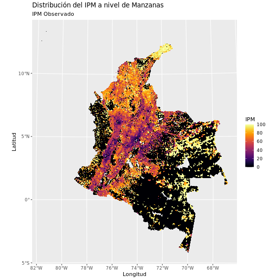
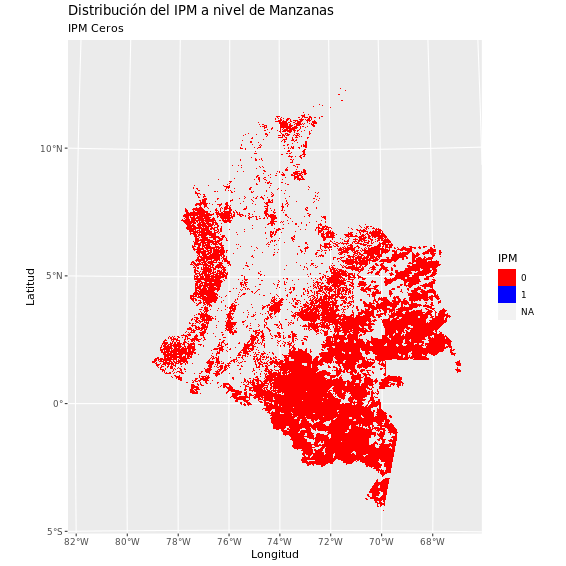

# Estimación Pobreza multidimensional 
## Introducción

El Departamento Administrativo Nacional de Estadística – DANE tiene como misión fundamental garantizar la disponibilidad y la calidad de la información estadística estratégica para el desarrollo económico y político del país, en el marco de sus objetivos misionales, así como garantizar la producción, disponibilidad y calidad de la información estadística estratégica; y dirigir, planear, ejecutar, coordinar, regular y evaluar la producción y difusión de información oficial básica.

En ese sentido, el DANE tiene como objetivo mejorar la disponibilidad de estadísticas relevantes con niveles de desagregación más detallados (relacionado con grupos poblacionales, o con dominios geográficos); así como de producir estadísticas relevantes con una mayor frecuencia. Un medio para lograrlo es a partir de la integración de las diferentes fuentes de información tradicionales (como encuestas y censos) con fuentes alternativas (como imágenes satelitales, registros administrativos, técnicas de big data, entre otros).

En Colombia, actualmente se cuenta con dos tipos de mediciones oficiales de la pobreza, estas medidas son la pobreza monetaria y la pobreza multidimensional. Dichos indicadores, cuentan con metodologías oficiales establecidas en el CONPES 150 de 2012. En particular, en el desarrollo de este trabajo solo será de interés el indicador del índice de pobreza multidimensional (IPM) que se obtuvo del Censo nacional de población y vivienda 2018 (CNPV 2018) y sus niveles de desagregación geográfico.

El enfoque empleado en la construcción del IPM censal está basado en la metodología de Alkire y Foster (Alkire, 2011), en la cual, se construye la medida basándose en cinco dimensiones (condiciones educativas del hogar, condiciones de la niñez y juventud, salud, trabajo, acceso a servicios públicos domiciliarios y condiciones de la vivienda) y 15 indicadores1. Sin embargo, los resultados de dicha implementación no son comparables ni reemplazan las mediciones oficiales del IPM realizadas por el DANE con periodicidad anual. Por lo tanto, el objetivo principal de dicho ejerció, es el aprovechamiento de la información del CNPV 2018 y su alto grado de granularidad.

Uno de los temas prioritarios para el DANE, tanto por que se encuentra enmarcado en los compromisos globales de la Agenda 2030 para el Desarrollo Sostenible, como por su importancia para el proceso de elaboración de políticas públicas, es la medición periódica de pobreza, bien sea monetaria o multidimensional. Prueba de la importancia de esta medición para Colombia es que actualmente se producen dos medidas oficiales de pobreza: la pobreza monetaria y la pobreza multidimensional.

Si bien se considera que el DANE cuenta con avances significativos en lo que respecta a la medición de pobreza a nivel departamental y en las ciudades principales del país, así como en lo que refiere a la medición de la pobreza multidimensional de fuente censal para todos los municipios, se ha identificado la necesidad de contar con mediciones periódicas de pobreza para los municipios que no son representativos en las encuestas de hogares.

Como se mencionó anteriormente, una herramienta para lograr suplir la medición periódica de pobreza es el uso de nuevas fuentes alternativas de datos. En particular, el uso de imágenes satelitales, combinado con técnicas de big data y estadística, han demostrado ser efectivos para la medición de la pobreza en altos niveles de desagregación.

Para Colombia, se adaptaron estas metodologías dependiendo de los insumos y la capacidad de computo disponible, por lo tanto, al igual que la construcción del IPM censal, los resultados que se obtienen no son comparables ni reemplazan las mediciones oficiales.

## Contenido

1. [Resumen](#introducción) 
A pesar  de todas las cualidades con las que cuenta el CNPV 2018, dicha operación no consigue aportar información del fenómeno de pobreza multidimensional en gran parte del territorio. Adicionalmente, el siguiente gráfico muestra la distribición territorial del  IMP censal:
El desafio, se centra en encontrar un estimación para las zonas en donde la información censal tiene falencias, el siguiente gráfico muestra la magnitud del desafio:
 

Los resultados del IPM censal solo son posibles en años en donde se realicen censos. Por tanto, este ejercicio  consiste en determinar una medición de estas zonas para el año 2018.

3. [Piloto DataSandbox](#piloto) 
Este piloto consiste en un ejercicio experimental para obtener predicciones del IPM usando información no tradicional.  Esta sección presenta un proyecto piloto en el cual se desarrolló al final un visor   de las diferentes oredicciones del IPM. Las fases de esta implementación se resumen en el siguiente gráfico:  

4. [Conjuntos de datos](#insumos) Se usarón insumos censales, marco geostadítistico nacional, imágenes satelitales y covariados extraidos de las mismas. Sin embargo, en esta plataforma solo se comparten bases alfanúmericas.    

5. [Metodología](https://www.dane.gov.co/files/investigaciones/experimentales/ipm/IPM-documento-metodologico.pdf)
6. [Visualización resultados](#visualizacion) [Enlace para ver los resultados en el visor ](https://visores.dane.gov.co/visor-nuevo-ipm/)

Equipo IPM - DANE
Alejandro Arias.
Glenn Amaya.
Sebastián Oviedo.
